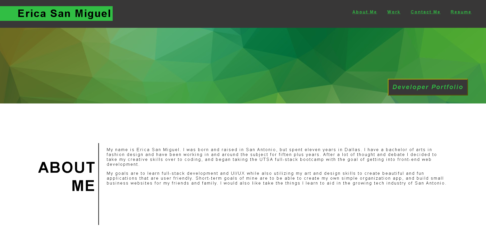

# Developer Portfolio Sample

A base portfolio for my web development career that I can link projects I made in and outside of class. 

## Installation

N/A

## Usage

Portfolio Sample webpage:

https://erica-210.github.io/Advanced-CSS-Challenge/

Github Repository:

## Credits

Read Me Examples: 
https://coding-boot-camp.github.io/full-stack/github/professional-readme-guide

https://www.makeareadme.com/

Refrence for HTML and CSS: 
https://www.w3schools.com/

https://stackoverflow.com/

https://teamtreehouse.com/community/putting-my-h1-and-nav-bar-in-the-same-line

Banner Image:
https://www.vecteezy.com/vector-art/4560276-green-polygonal-crystal-background-polygon-design-pattern-environment-green-low-poly-vector-illustration-and-backdrop

Study Group:
Arturo Vargas
Christian Baca

Tutoring:
Jili Jiang

## License

[MIT](https://choosealicense.com/licenses/mit/)